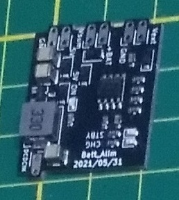
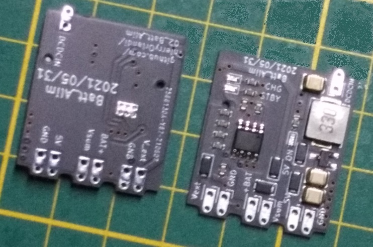
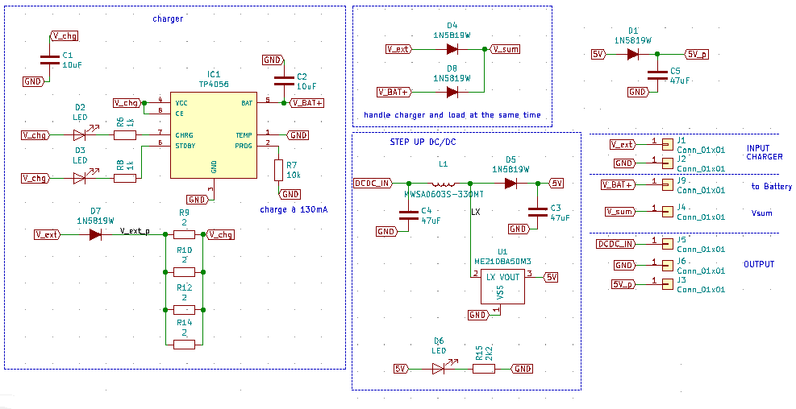
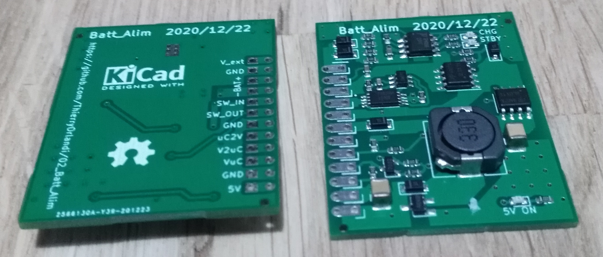

# 02_Batt_Alim

Le module Batt_Alim permet de gérer la charge d'une batterie Lipo constituée d'une seule cellule (4.2V) à partir d'une source de type 5V USB.
Il permet aussi de récupérer cette tension batterie variable et de reconstituer un 5V constant grâce à un DCDC.

La licence est celle du CERN Open Hardware Licence version 2; CERN-OHL-P ; permissive.
Le fichier de cette license est présent dans le répertoire: cern_ohl_p_v2.txt

# Photos

Ci-joint la photo de la version de 2021_06_04 // Here picture of version 2021_06_04:

# Schéma et fonctionnement

Ci-joint le schéma de la version de 2021_06_04 // Here schematic of version 2021_06_04:

Le module fonctionne de la façon suivante:
Il faut l'alimenter avec une tension 5V +-5% (typiquement celle de l'USB classique) sur la pin Vext. (Ne pas oublier GND bien sûr).

Il faut brancher la batterie Lipo sur V_bat+ et GND.

La sortie V_sum est à relier à DCDC_IN (ceci permet d'insérer un interrupteur à cet endroit).

La sortie 5V_p est une tension issue du DCDC qui est filtrée et protégée par la diode D1 et le condensateur C5.

La LED D6 indique la présence de 5V à la sortie du DCDC, avec "5V ON" comme étiquette.

Les LEDs D2 et D3 indiquent respectivement la charge et le mode standby du TP4056. Les étiquettes sont "CHG" et "STBY".

# Archives:

Ci-joint la photo de la version de 2020_12_22 // Here picture of version 2020_12_22:

